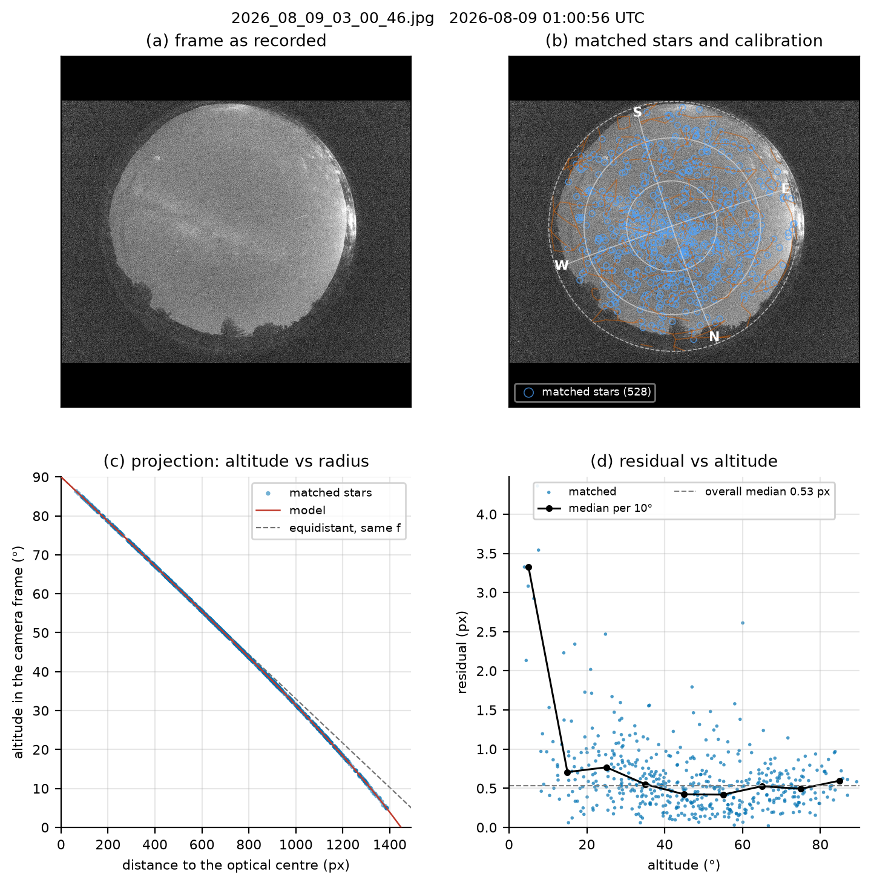

# ascal — zero-shot geometric calibration of all-sky cameras

`ascal` calibrates the geometry of a fisheye all-sky camera from **one night image**, with no
prior calibration, no sky mask and no manual identification of stars. You give it the image, the
site (latitude, longitude) and the time of the exposure; it returns the mapping between pixels and
horizontal coordinates (altitude, azimuth), the residuals against the Hipparcos catalogue and a set
of diagnostic figures.

It is the calibration software of the [Lumaria](https://lumaria.allandestars.com) light-pollution
monitoring stations ([Allande Stars](https://allandestars.com)), developed on the first station
prototype at the Zreizeda Remote Observatory (ZRO, Cereceda, Allande, Asturias), and it is
independent of that project: it works on any image of the whole sky in which stars are visible.

**Version 1.0** was qualified on 23 different all-sky systems: fireball-network cameras (Desert Fireball
Network, FRIPON), professional site monitors (MMT, ESO Paranal, Liverpool Telescope, KLCAM at Dome A) and amateur
stations of the Allsky network, with images from 0.3 to 77 Mpx, monochrome and colour, JPEG, FITS and camera raw.
Every one of them is calibrated in less than 40 s on a desktop CPU (median about 10 s).

The method is described in *Automatic astrometric calibration of low-cost all-sky cameras* (manuscript, 2026). On a Raspberry Pi HQ Camera with a 1.55 mm M12 fisheye lens installed
by hand (3.7° off the zenith) it reaches a median residual of 0.5–0.6 px (about 2 arcmin) on nights
it has never seen, with 76–88 % of the stars within one pixel.

<p align="center"></p>

<p align="center"><sub>The summary panel written with every calibration: (a) the frame; (b) the 528 matched stars, altitude circles at 0°, 30°, 60°, the N–S and E–W lines and the constellation figures drawn with the fitted model; (c) altitude in the camera frame against distance to the optical centre; (d) residual against altitude.</sub></p>

## What it does

1. **Detects stars** with DAOStarFinder (photutils) after subtracting a 2-D median background, inside
   the illuminated disc of the lens (found automatically). The kernel width is set from the FWHM
   of the stars, measured on the frame itself; undersampled stars (FWHM < 2.2 px) are smoothed first.
   Images above 16 Mpx are detected in 3 × 3 tiles in parallel.
2. **Runs a cascade of hypotheses** about the image and stops at the first one that passes the quality
   gate: the sky disc (as detected, then circles inscribed and circumscribed to the sensor, then Hough
   circles), the parity (direct or mirrored image, tested together), the radial prior (equisolid-,
   stereographic- or equidistant-like lens) and, as a last resort, a wider detection kernel. For each
   hypothesis the **pose is found blindly** (rotation, zenith displacement, focal scale) by counting
   catalogue stars that land on detections, with a distance map of the detections (about 1 s).
3. **Associates and fits progressively** (mag ≤ 4.5 / 25 px → 5.5 / 12 px → 7 px, radii scaled with the
   plate scale) with unique and mutual pairs, a robust loss and per-altitude-band clipping, against
   apparent (refracted) altitudes.
4. **Accepts** a calibration when the fit is tight and either covers a fair fraction of the stars
   bright enough to be seen in the frame, or its pose clearly beats every rival; otherwise it moves to
   the next hypothesis, within a time budget (`--max-time`, 40 s by default).
5. **Reports** the model, residual statistics per altitude band and a set of figures (see *Output*).

The camera model (see [docs/model.md](docs/model.md)) chains a **rigid 3-D rotation** of the optical
axis (so the camera need not be levelled), the **Kannala–Brandt** odd-polynomial radial function
(`r = f(θ + k3 θ³ + k5 θ⁵)`, with `f` the focal length in px/rad), the image rotation and the optical
centre: eight parameters. An optional two-parameter **Brown–Conrady decentering** term (the extended model of the paper)
can be fitted when the residual map shows its signature.

## Installation

```bash
git clone https://github.com/GonzalezFJR/ascal.git
cd ascal
pip install .            # core: numpy, scipy, astropy, photutils, opencv-python-headless, Pillow, matplotlib
pip install ".[web]"     # + fastapi, uvicorn, python-multipart for the web demo
pip install ".[raw]"     # + rawpy, for camera raw files (NEF, CR2, ARW, DNG...)
```

Python ≥ 3.10. Tested with photutils 1.6 (Raspberry Pi OS) and 3.0.

## Quick start

Three clear frames of the ZRO station are included in `examples/images/` (Raspberry Pi HQ Camera,
IMX477 4056×3040, EDATEC 1.55 mm fisheye, 20 s at ISO 1600; timestamps in the file names are local
time, `Europe/Madrid`).

```bash
# calibrate from one frame; the model, statistics and figures go to 2026_08_09_03_00_46_ascal/
ascal calibrate examples/images/2026_08_09_03_00_46.jpg \
    --lat 43.259147 --lon -6.60345 --elev 650 --tz Europe/Madrid --out calib.json

# score that calibration on another night without refitting
ascal check calib.json examples/images/2026_07_08_01_01_06.jpg \
    --lat 43.259147 --lon -6.60345 --tz Europe/Madrid

# convert coordinates
ascal project calib.json --alt 45 --az 180
ascal project calib.json --x 2028 --y 1520
```

Typical output for one frame (desktop CPU, 12 s including detection; `--quiet` hides the search log):

```
2026_08_09_03_00_46.jpg: 4605 detections (kernel FWHM 4 px (stars 2.79 px)), mid-exposure 2026-08-09 01:00:56 UTC, disc centre (2004, 1390) radius 1438 px
  [sky_disc] poses: direct n=190 f=1008 psi=161, mirror n=31 f=640 psi=10, direct n=29 f=642 psi=161, mirror n=28 f=643 psi=150
    refine direct prior [-0.03, 0.0]: 528 pairs (need 141 of 945 expected to m<=5.3; pose margin x6.1), median 0.53 px -> ACCEPT

accepted: disc hypothesis 'sky_disc', detection level 0, parity direct, radial prior [-0.03, 0.0], pose margin x6.13

CameraModel(cx=1948.57, cy=1467.81, f=1005.53 px/rad, psi=161.0553°, tilt=(-1.8244, -3.2786)°, k=[-0.0208, -0.00525])
total tilt 3.75 deg, zenith at pixel (1884, 1456), horizon radius 1448 px, 3.42 arcmin/px on axis
528 pairs, median 0.53 px, rms 1.01 px, p90 1.12 px, 87% within 1 px, 12.5 s in total
  alt   3-10: n    17  median 3.33  p90 6.33
  alt  10-20: n    40  median 0.71  p90 1.39
  ...
report written to 2026_08_09_03_00_46_ascal/
```

**Time of the exposure.** The mid-exposure instant is what matters. `ascal` uses, in this order,
`--time` (ISO 8601; aware, or naive in `--tz`), the EXIF `DateTimeOriginal`, or a
`YYYY_MM_DD_HH_MM_SS` timestamp in the file name, and adds half the exposure (EXIF `ExposureTime` or
`--exposure`). An error of 10 s in time is a 0.04° shift of the sky (≈ 0.7 px on this camera).

**Several frames.** Pass more than one image (same camera and site) to fit them together; frames
from different nights constrain the model better than frames of the same night.

**Star detection.** By default (`--fwhm auto`) `ascal` measures the FWHM of the unsaturated stars
with Gaussian fits in the centre of the disc and uses a DAOStarFinder kernel 1.3 times wider, never
narrower than 4 px (the kernel of the paper, which the ZRO frames keep: their stars measure 2.8 px)
nor wider than 12 px. If no hypothesis passes, the detection is repeated with kernels 1.5 and 2 times
wider. Stars narrower than 2.2 px (small sensors, short focal lengths, FITS from video cameras) are
smoothed with a Gaussian before detection, because DAOStarFinder's shape cuts reject single-pixel
stars as hot pixels. A kernel much narrower than the stars loses the bright,
saturated stars the pose search relies on: a DSLR frame from Dome A (stars of 4.7 px, 8-bit JPEG
with a bright sky background) fails with a 4 px kernel and calibrates to 0.40 px with 6 px. The
kernel can be fixed with `--fwhm 6`; `--threshold` (background sigmas, default 4) and
`--roundness` (default 0.7) are also exposed.

**Large images and low-memory machines.** Above 16 Mpx the detection runs in 3 × 3 overlapping tiles
processed in parallel (`--tiles auto`, the default): a 36-Mpx DSLR raw frame calibrates in about 17 s
and a 77-Mpx FITS frame in about 30 s (2.9 GB of memory). On a Raspberry Pi use `--tiles 2` or `3` to
bound memory (about 350 MB for a 12-Mpx frame).

**Image formats.** JPEG, PNG and TIFF (8 or 16 bit), FITS (`.fits`, `.fit`, `.fts`, gzipped too; the
exposure start and length are read from `DATE-OBS` and `EXPTIME`/`EXPOSURE`) and camera raw files
(`.nef`, `.cr2`, `.cr3`, `.arw`, `.dng`... with `pip install "ascal[raw]"`; the linear green plane is
used). FITS images, whose origin is at the bottom, need no flipping: the parity is found
automatically and stored in the calibration (`"mirror": true`), so the model always maps to the
pixels of the file as given.

## Options: what to change when a calibration fails

| Symptom | Option |
|---|---|
| Takes too long on a slow machine, or you can afford a longer search | `--max-time S` (default 40 s, detection included) |
| The sky disc is not found (strong overlays, an image cropped by the sensor) | `--disc CX,CY,R` |
| You know the image is mirrored (or not) | `--parity mirror` / `--parity direct` (default `auto` tries both) |
| Wide or bloated stars, or very bright background | `--fwhm 6` (or wider), `--threshold 5` |
| Few stars per frame (bright Moon, short exposures, small sensor) | calibrate several frames of the same night together: `ascal calibrate a.fits b.fits c.fits ...` |
| Compare with 0.x results | `--no-refraction` |
| Memory | `--tiles 2` |

The failure message says which case applies: no pose found (too few stars, clouds, wrong site or
time), no hypothesis passed the gate, or the time limit was reached.

## Output

Unless `--no-report` is given, `ascal calibrate` writes a report directory (`<image>_ascal/`, or `--report DIR`):

| File | Content |
|---|---|
| `calibration.json` | the camera model (see [docs/model.md](docs/model.md)); load it with `CameraModel.load` |
| `summary.json` | residual statistics (all and per altitude band), the accepted hypothesis of the cascade, timings |
| `pairs.csv` | matched star–detection pairs: frame, Hipparcos number, magnitude, alt, az, x, y, flux, residual, inlier flag |
| `panel.png` | summary figure (above): frame, matched stars with altitude circles, N–S/E–W lines and constellations, altitude vs radius, residual vs altitude (`panel_<frame>.png` for each of the first three frames when several are fitted) |
| `overlay_<frame>.png` | catalogue stars (m ≤ 4.5) projected on the frame, with zenith and optical centre |
| `cutouts_<frame>.png` | cut-outs around bright stars: detections and predicted positions |
| `residuals.png` | residual against altitude, residual vectors on the sensor, histogram |
| `radial.png` | radial function and plate scale against the ideal fisheye projections |

`--out FILE` writes an extra copy of the calibration JSON. `ascal check calib.json IMG ... --report DIR` writes overlays
of an existing calibration on other frames.

## Validation on 23 all-sky systems

Version 1.0 was run, with default options, on one night frame of each of 23 different cameras, from the site
coordinates and the time alone. Every frame was calibrated; where a second frame of the same camera was available (18
systems), the calibration predicted its stars with a median residual below 1.5 px without refitting.

| System | Camera | Image (px) | Stars | Median (px) | Time (s) |
|---|---|---|---|---|---|
| ZRO, Lumaria prototype (this project) | Raspberry Pi HQ, 1.55 mm | 4056 × 3040 | 528 | 0.53 | 9.9 |
| MMT Observatory all-sky camera | ZWO ASI294MC Pro | 1422 × 1411 | 745 | 0.21 | 5.7 |
| ESO Paranal MASCOT | monochrome CCD | 580 × 512 | 361 | 0.12 | 4.1 |
| ESO Paranal ALPACA | monochrome, FITS | 8750 × 8750 | 453 | 1.21 | 29.6 |
| Liverpool Telescope SkyCamA | Starlight Xpress CCD | 1392 × 1040 | 652 | 0.26 | 5.9 |
| KLCAM, Dome A | DSLR, JPEG | 3476 × 5208 | 828 | 0.39 | 9.8 |
| Desert Fireball Network, DFNEXT029 | Nikon D810 + Samyang 8 mm, raw NEF | 7380 × 4928 | 919 | 0.45 | 17.1 |
| FRIPON / SCAMP, Cardiff | Basler acA1300, 12-bit FITS (full Moon) | 1296 × 966 | 34 | 0.30 | 14.7 |
| FRIPON / SCAMP, Honiton | DMK 23G445, FITS (full Moon) | 1280 × 960 | 84 | 0.42 | 7.6 |
| FRIPON / SCAMP, Manchester | Basler acA1300, FITS (full Moon) | 1296 × 966 | 38 | 0.56 | 7.6 |
| 13 stations of the Allsky software network | Raspberry Pi HQ; ZWO ASI178, 224, 676, 678 | 1304 × 976 – 4056 × 3040 | 269–988 | 0.33–1.24 (median 0.45) | 5.4–21.9 |

Mean time 10.4 s, maximum 29.6 s (desktop CPU). Frames in which most of the sky is hidden (buildings, trees, dew
drops on the dome, clouds) or washed out by the Moon in an urban sky are not suitable: the cascade then exhausts its
hypotheses or its time budget and reports the failure.

## Python API

```python
from ascal import Site, calibrate, evaluate, load_frame, CameraModel, plots

site = Site(lat=43.259147, lon=-6.60345, elev=650)
frame = load_frame("examples/images/2026_08_09_03_00_46.jpg", tz="Europe/Madrid", keep_image=True)
result = calibrate([frame], site)                 # CalibrationResult: model, pairs, inliers, info
model = result.model                              # CameraModel
print(result.summary())                           # median, rms, p90, within 1 px, per altitude band, timings
model.save("calib.json"); model = CameraModel.load("calib.json")

x, y = model.project(alt, az)                     # sky -> pixel (degrees in, pixels out; NaN below the horizon)
alt, az = model.unproject(x, y)                   # pixel -> sky
omega = model.solid_angle(x, y)                   # sr per pixel^2, to weight sky maps
model.total_tilt, model.zenith_pixel, model.horizon_radius, model.plate_scale(theta_deg)

pairs = evaluate(model, [other_frame], site)      # associations with a fixed model (no fitting)
pairs.residuals(model)                            # pixels
plots.calibration_panel(frame, result, site, path="panel.png")   # the 2 x 2 summary figure
plots.overlay(frame, model, site, path="overlay.png"); plots.residual_plots(result, path="residuals.png")

with ascal.config.options(max_time=60, parity="mirror"):   # options of the CLI, for a block of code
    result = calibrate([frame], site)
```

`docs/model.md` documents the equations, the parameters and the JSON format.

## Notebook

[`notebooks/demo.ipynb`](notebooks/demo.ipynb) walks through the calibration of one of the example
frames step by step (detection, the cascade of hypotheses, the fit, the summary panel and the other figures) and
checks the result on the other two frames without refitting. It is stored
executed; to rebuild and re-run it:

```bash
pip install ".[dev]"
python notebooks/build_demo.py && jupyter nbconvert --to notebook --execute --inplace notebooks/demo.ipynb
```

## Web demo

```bash
pip install ".[web]"
ascal web            # http://127.0.0.1:8000
```

Drop an image, check the site and time (pre-filled from EXIF or the file name when possible), press
*Calibrate*, and get the parameters, per-band residuals, the summary panel, overlay, cut-outs, residual plots and
the calibration JSON. The computation runs in the server process, one job at a time.

## Inputs, outputs and limits

* **Input**: one or more images (JPEG, PNG, TIFF, FITS, camera raw; colour or grey) of the whole sky with stars
  visible down to about magnitude 4–5; the site; the time. Frames need not be levelled, oriented or
  masked. Typical exposure: 10–30 s with a fisheye at F2.
* **Quality gate**: a hypothesis is accepted when the median residual is at most 1.2 px (2 px for large, unambiguous
  solutions), at least 30 pairs survive, and either 15 % of the stars expected down to the frame's limiting magnitude
  are matched or the pose beats every rival by a factor of 2. Clouds, twilight, a wrong site or time, or a badly
  focused frame make every hypothesis fail. Expect 0.3–0.8 px for a good frame; a fit above 1 px deserves a look at
  the panel.
* **Lowest altitudes** (< 10°) are limited by the detections (extinction, small plate scale, the edge
  of the disc), not by the model; expect 2–4 px there.
* **Refraction**: catalogue altitudes are corrected to apparent altitudes (Saemundsson 1986, with the pressure from
  `--elev`). Nutation and aberration (< 0.1 px) are neglected.
* **Field of view**: the method is for fisheye cameras that see most of the sky (roughly 150–200°). Wide-angle lenses
  with a rectangular field of 90–150° sometimes calibrate but are outside the scope. Two radial coefficients suit
  most fisheye lenses; `CameraModel.k` accepts more.

## Repository layout

```
ascal/                package: model.py (camera model, fit), catalog.py (Hipparcos, astrometry, refraction),
                      detect.py (readers, sky disc, DAOStarFinder, tiles), match.py (association, zero point),
                      fast.py (cascade of hypotheses, pose search, gate), bootstrap.py (refinement, calibrate,
                      evaluate), config.py (options), plots.py, cli.py, web/ (FastAPI app + static page),
                      data/ (Hipparcos to V = 6.5, constellation figures; see data/NOTICE.md)
examples/images/      three clear frames of the ZRO station + manifest.json
notebooks/demo.ipynb  executed walk-through
tests/                unit tests and end-to-end tests on a bundled frame (mirrored FITS, time limit, CLI report)
docs/model.md         the model and the fitting procedure
```

Run the tests with `pytest` (about 50 s; `pytest -m "not slow"` skips the end-to-end tests).

## Citing

If you use this software, please cite the paper (reference to be completed on publication) and this
repository:

> González Fernández JR, Hermosa Muñoz L, Fernández Alonso M, González Cuesta L. Automatic astrometric
> calibration of low-cost all-sky cameras. 2026 (submitted to The Open Journal of Astrophysics).
> Code: https://github.com/GonzalezFJR/ascal

The camera model follows Kannala & Brandt (2006, IEEE TPAMI 28:1335) for the radial function,
Ceplecha (1987) and Borovička et al. (1995) for the rotation formulation of all-sky astrometry, and
Conrady (1919) / Brown (1966) for the decentering term. Star positions come from the Hipparcos
catalogue (ESA 1997); detection uses photutils' DAOStarFinder (Stetson 1987).

## License

MIT. The example images are © Allande Stars / Lumaria and may be used under the same terms. The constellation
figures come from d3-celestial (© Olaf Frohn, BSD 3-Clause); see `ascal/data/NOTICE.md`.
