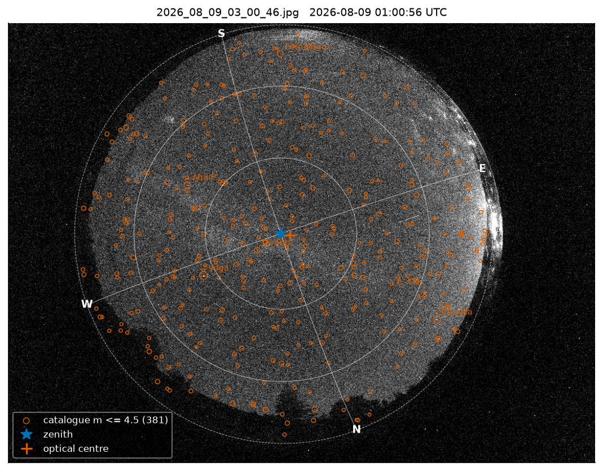

# allskycal — zero-shot geometric calibration of all-sky cameras

`allskycal` calibrates the geometry of a fisheye all-sky camera from **one night image**, with no
prior calibration, no sky mask and no manual identification of stars. You give it the image, the
site (latitude, longitude) and the time of the exposure; it returns the mapping between pixels and
horizontal coordinates (altitude, azimuth), the residuals against the Hipparcos catalogue and a set
of diagnostic figures.

It is the calibration software of the [Lumaria](https://lumaria.allandestars.com) light-pollution
monitoring stations ([Allande Stars](https://allandestars.com)), developed on the first station
prototype at the Zreizeda Remote Observatory (ZRO, Cereceda, Allande, Asturias), and it is
independent of that project: it works on any image of the whole sky in which stars are visible.

The method is described in *Geometric calibration of the low-cost all-sky cameras of the Lumaria
project* (manuscript, 2026). On a Raspberry Pi HQ Camera with a 1.55 mm M12 fisheye lens installed
by hand (3.7° off the zenith) it reaches a median residual of 0.5–0.6 px (about 2 arcmin) on nights
it has never seen, with 76–88 % of the stars within one pixel.

<p align="center"></p>

## What it does

1. **Detects stars** with DAOStarFinder (photutils) after subtracting a 2-D median background, inside
   the illuminated disc of the lens (found automatically).
2. **Finds the pose blindly**: image rotation, displacement of the zenith from the disc centre and
   focal scale, by counting how many catalogue stars brighter than magnitude 3 land on bright
   detections.
3. **Associates and fits progressively** (mag ≤ 3.5 / 30 px → 4.5 / 25 px → 5.5 / 12 px → 7 px) with
   unique and mutual pairs, a robust loss and per-altitude-band clipping.
4. **Reports** the model, residual statistics per altitude band, overlays, cut-outs and the radial
   function against the ideal fisheye projections.

The camera model (see [docs/model.md](docs/model.md)) chains a **rigid 3-D rotation** of the optical
axis (so the camera need not be levelled), the **Kannala–Brandt** odd-polynomial radial function
(`r = f(θ + k3 θ³ + k5 θ⁵)`, with `f` the focal length in px/rad), the image rotation and the optical
centre: eight parameters. An optional two-parameter **Brown–Conrady decentering** term (model B)
can be fitted when the residual map shows its signature.

## Installation

```bash
git clone https://github.com/GonzalezFJR/allsky_calibration.git
cd allsky_calibration
pip install .            # core: numpy, scipy, astropy, photutils, opencv-python-headless, Pillow, matplotlib
pip install ".[web]"     # + fastapi, uvicorn, python-multipart for the web demo
```

Python ≥ 3.10. Tested with photutils 1.6 (Raspberry Pi OS) and 3.0.

## Quick start

Three clear frames of the ZRO station are included in `examples/images/` (Raspberry Pi HQ Camera,
IMX477 4056×3040, EDATEC 1.55 mm fisheye, 20 s at ISO 1600; timestamps in the file names are local
time, `Europe/Madrid`).

```bash
# calibrate from one frame, write the model and a report with figures
allskycal calibrate examples/images/2026_08_09_03_00_46.jpg \
    --lat 43.259147 --lon -6.60345 --elev 650 --tz Europe/Madrid \
    --out calib.json --report report/

# score that calibration on another night without refitting
allskycal check calib.json examples/images/2026_07_08_01_01_06.jpg \
    --lat 43.259147 --lon -6.60345 --tz Europe/Madrid

# convert coordinates
allskycal project calib.json --alt 45 --az 180
allskycal project calib.json --x 2028 --y 1520
```

Typical output for one frame (desktop CPU, 11 s including detection):

```
sky disc: centre (2004, 1390), radius 1438 px -> f0 = 915 px/rad
  candidate psi 161.0 deg, zenith shift (-115, 70) px, focal x1.12: 19/23 bright coincidences -> 197 pairs
  stage 2: mag <= 5.5, radius 7 px -> 581 pairs, median 0.56 px, p90 1.76 px
  final: 547 pairs, median 0.53 px, rms 1.08 px
CameraModel(cx=1948.54, cy=1467.83, f=1005.32 px/rad, psi=161.0569°, tilt=(-1.8272, -3.2787)°, k=[-0.02106, -0.0052])
total tilt 3.75 deg, zenith at pixel (1884, 1456), horizon radius 1447 px, 3.42 arcmin/px on axis
547 pairs, median 0.53 px, rms 1.08 px, p90 1.16 px, 85% within 1 px
```

**Time of the exposure.** The mid-exposure instant is what matters. `allskycal` uses, in this order,
`--time` (ISO 8601; aware, or naive in `--tz`), the EXIF `DateTimeOriginal`, or a
`YYYY_MM_DD_HH_MM_SS` timestamp in the file name, and adds half the exposure (EXIF `ExposureTime` or
`--exposure`). An error of 10 s in time is a 0.04° shift of the sky (≈ 0.7 px on this camera).

**Several frames.** Pass more than one image (same camera and site) to fit them together; frames
from different nights constrain the model better than frames of the same night.

**Low-memory machines.** `--tiles 2` runs the detection in four overlapping tiles (about 350 MB
instead of > 1 GB for a 12-Mpx frame). A Raspberry Pi 4 calibrates a frame in about a minute.

## Python API

```python
from allskycal import Site, calibrate, evaluate, load_frame, CameraModel, plots

site = Site(lat=43.259147, lon=-6.60345, elev=650)
frame = load_frame("examples/images/2026_08_09_03_00_46.jpg", tz="Europe/Madrid", keep_image=True)
result = calibrate([frame], site)                 # CalibrationResult: model, pairs, inliers, info
model = result.model                              # CameraModel
print(result.summary())                           # median, rms, p90, within 1 px, per altitude band, timings
model.save("calib.json"); model = CameraModel.load("calib.json")

x, y = model.project(alt, az)                     # sky -> pixel (degrees in, pixels out; NaN below the horizon)
alt, az = model.unproject(x, y)                   # pixel -> sky
omega = model.solid_angle(x, y)                   # sr per pixel^2, to weight sky maps
model.total_tilt, model.zenith_pixel, model.horizon_radius, model.plate_scale(theta_deg)

pairs = evaluate(model, [other_frame], site)      # associations with a fixed model (no fitting)
pairs.residuals(model)                            # pixels
plots.overlay(frame, model, site, path="overlay.png"); plots.residual_plots(result, path="residuals.png")
```

`docs/model.md` documents the equations, the parameters and the JSON format.

## Notebook

[`notebooks/demo.ipynb`](notebooks/demo.ipynb) walks through the calibration of one of the example
frames step by step, with the figures, and checks the result on the other two frames. It is stored
executed; to rebuild and re-run it:

```bash
pip install ".[dev]"
python notebooks/build_demo.py && jupyter nbconvert --to notebook --execute --inplace notebooks/demo.ipynb
```

## Web demo

```bash
pip install ".[web]"
allskycal web            # http://127.0.0.1:8000
```

Drop an image, check the site and time (pre-filled from EXIF or the file name when possible), press
*Calibrate*, and get the parameters, per-band residuals, overlay, cut-outs, residual plots and the
calibration JSON. The computation runs in the server process, one job at a time.

## Inputs, outputs and limits

* **Input**: one or more images (JPEG, PNG, TIFF…; colour or grey) of the whole sky with stars
  visible down to about magnitude 4–5; the site; the time. Frames need not be levelled, oriented or
  masked. Typical exposure: 10–30 s with a fisheye at F2.
* **Output**: `calibration.json` (see `docs/model.md`), `summary.json`, `pairs.csv`
  (star–detection pairs with residuals), figures.
* **Quality gate**: a calibration is rejected when fewer than 80 pairs survive or the median residual
  exceeds 2 px (clouds, twilight, wrong site or time, badly focused frame). Expect 0.5–0.8 px for a
  good frame; a fit above 1 px deserves a look at the overlay.
* **Lowest altitudes** (< 10°) are limited by the detections (extinction, small plate scale, the edge
  of the disc), not by the model; expect 2–4 px there.
* **Refraction** is not applied to the catalogue: the radial function absorbs the mean refraction of
  the night (1–2 px at 10°). Nutation and aberration (< 0.1 px) are neglected.
* **Other cameras**: the pose search assumes a field of view of roughly 150–200° so that the sky disc
  is visible; the initial focal length is taken from the disc radius. Two radial coefficients suit
  most fisheye lenses; `CameraModel.k` accepts more.

## Repository layout

```
allskycal/            package: model.py (camera model, fit), catalog.py (Hipparcos, astrometry),
                      detect.py (frames, sky disc, DAOStarFinder), match.py (association, zero point),
                      bootstrap.py (blind pose search, progressive refinement, evaluation),
                      plots.py, cli.py, web/ (FastAPI app + static page), data/hipparcos_mag65.json
examples/images/      three clear frames of the ZRO station + manifest.json
notebooks/demo.ipynb  executed walk-through
tests/                unit tests (model, catalogue) and an end-to-end test on a bundled frame
docs/model.md         the model and the fitting procedure
```

Run the tests with `pytest` (the end-to-end test takes about 30 s).

## Citing

If you use this software, please cite the paper (reference to be completed on publication) and this
repository:

> González Fernández JR, Hermosa Muñoz L, Fernández Alonso M, González Cuesta L. Geometric calibration
> of the low-cost all-sky cameras of the Lumaria project: sub-pixel accuracy from a single image without
> levelling. 2026 (submitted to PLOS ONE). Code: https://github.com/GonzalezFJR/allsky_calibration

The camera model follows Kannala & Brandt (2006, IEEE TPAMI 28:1335) for the radial function,
Ceplecha (1987) and Borovička et al. (1995) for the rotation formulation of all-sky astrometry, and
Conrady (1919) / Brown (1966) for the decentering term. Star positions come from the Hipparcos
catalogue (ESA 1997); detection uses photutils' DAOStarFinder (Stetson 1987).

## License

MIT. The example images are © Allande Stars / Lumaria and may be used under the same terms.
